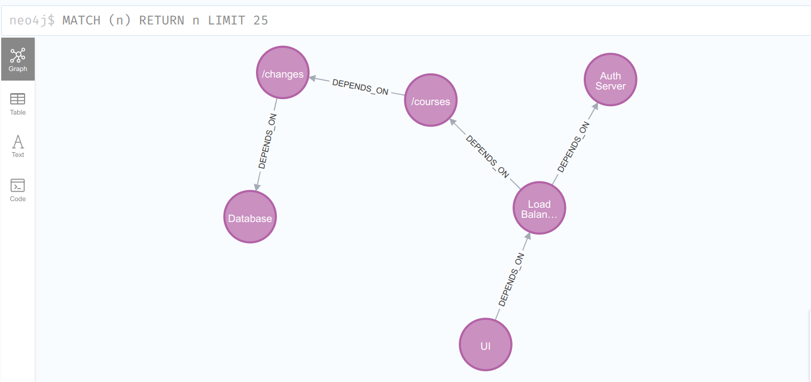
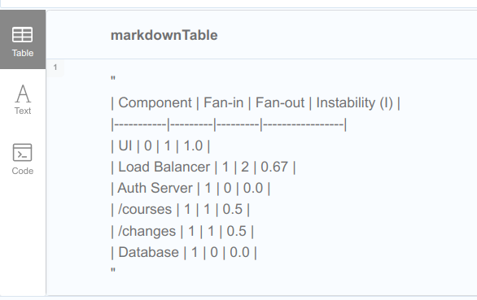

# System Dependencies in Neo4j

I tried to make dep graph of my lame solution... enjoy...

## 🚀 Setup Instructions

1. **Start Neo4j Container:**
```sh
docker-compose up -d
```

2. **Open Neo4j Browser** at `http://localhost:7474`.
3. **Authorize with credentials given in docker-compose.yml**
```yaml
environment:
      - NEO4J_AUTH=neo4j/pass12345
```
4. **Load Queries:**
   - Go to the Neo4j dashboard.
   - Drag and drop `init.cypher` file in the browser.
   - Run the query

as a result you will have something like this:
```markdown

```

## 📈 Stability Metrics Calculation

The following metrics are calculated for each component:

1. **Fan-in:** Number of incoming dependencies
2. **Fan-out:** Number of outgoing dependencies
3. **Instability (I):**

```
I = Fan-out / (Fan-in + Fan-out)
```
**Calculate instability:**
   - Go to the Neo4j dashboard.
   - Drag and drop `calculate.cypher` file in the browser.
   - Run the query

as a result you will have something like this:
```markdown

```
